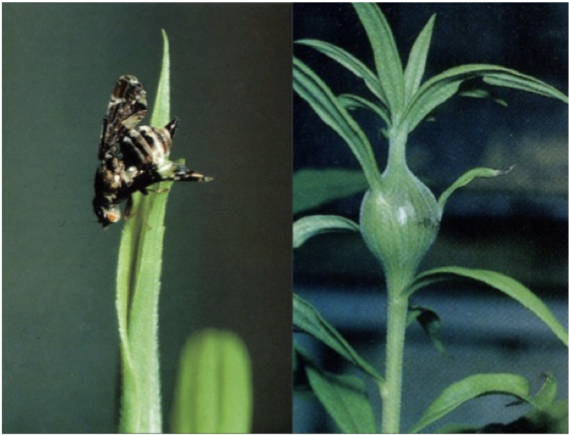
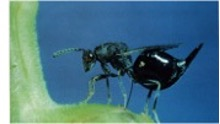
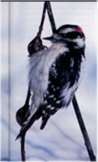
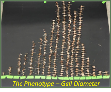
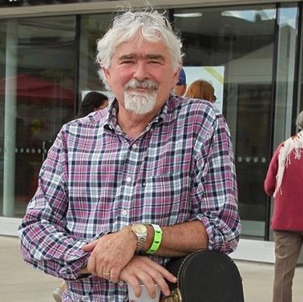

```{css, echo = FALSE}
body {
  background-color: white;
  color: black;
}
.main-container{
  max-width: 60%: 
}
```
<br>

<font size= "4"> A brief look at the goldenrod-gallfly system:

The goldenrod gallfly is a textbook example of stabilizing selection. This insect lays offspring in the stem of a goldenrod plant, inducing a spherical stem swelling – a gall. </font>
<br>
<br>
```{r, echo=FALSE, out.width = "400px", fig.align='center', dpi=72, fig.cap= "Left: Goldenrod gallfly (*Eurosta solidaginis*) ; Right: gall induced by oviposition "}

```
<br>
<br>
<font size= "4">Gall size is an important determinant of gallfly offspring survival. During the early summer, parasitoid wasps inject eggs into the gall, which attack and kill the gallfly larva as it develops. **However, the wasp’s ovipositor can reach only so far, and flies that induce big galls are safe from attack.**</font>
<br>
<br>
```{r, echo=FALSE, out.width = "300px", fig.align='center', dpi=72, fig.cap= "A gallfly predator, the parasitoid wasp, *Eurytoma gigantea*" }

```
<br>
<br>
<font size= "4">**Bigger is better, but biggest is not best!** Downy Woodpeckers become the fly’s main threat during winter. These birds easily peck open even the biggest gall. But they ignore smaller ones, probably because they learn these contain small wasp larvae, not the larger, more rewarding fly larva.  </font> 
<br>
<br>
```{r, echo=FALSE, out.width = "150px", fig.align='center', dpi=72, fig.cap="Another gallfly predator, the Downy Woodpecker" }

```
<br>
<br>
<font size= "4">And so, our past work shows that **larvae inducing intermediate sized galls have the highest survival—stabilizing selection**. At least, that’s what we find at study sites in Pennsylvania, Minnesota, and Ontario. We have also noticed that the average gall size is greater in the southern US than the Great Lakes region.</font>
<br>
<br>
```{r, echo=FALSE, out.width = "300px", fig.align='center', dpi=72, fig.cap= "Gall size distribution example from Ontario sampling site at the Koffler Scientific Reserve"}

```
<br>
<br>
<font size= "4">This leads us to our main question: ***does optimal gall size vary from north to south?*** </font>

<br>

<br>

<font size= "4">**Leading the project:**

```{r, echo=FALSE, out.width = "300px"}

```

Dr. Art Weis

Department of Ecology and Evolutionary Biology

The University of Toronto

</font>

<br>

<br>

```{r, echo=FALSE, out.width = "300px"}

```

Dr. Linyi Zhang

Department of Biology

The George Washington University


```{r, echo=FALSE, out.width = "300px"}

```

Dr. Glen Hood

Biological Sciences

Wayne State University

</font>

<br>

<br>


```{r, echo=FALSE, out.width = "300px"}

```

Dr. Tim Craig

Swenson College of Science and Engineering

University of Minnesota Duluth

</font>

<br>

<br>
